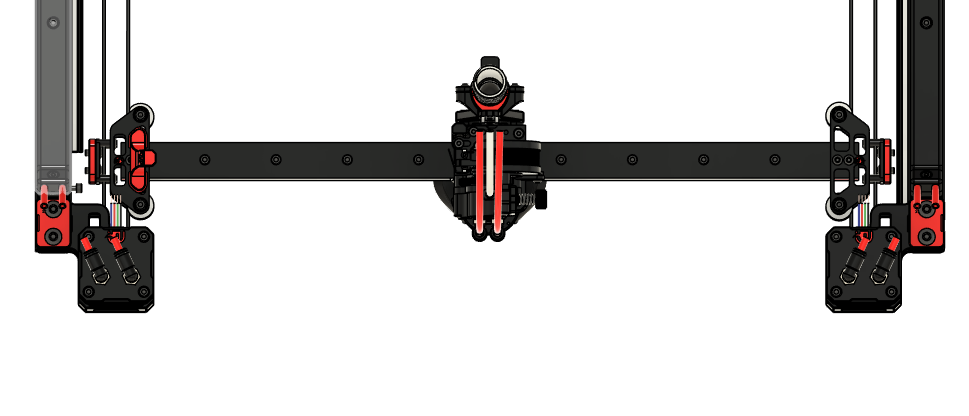
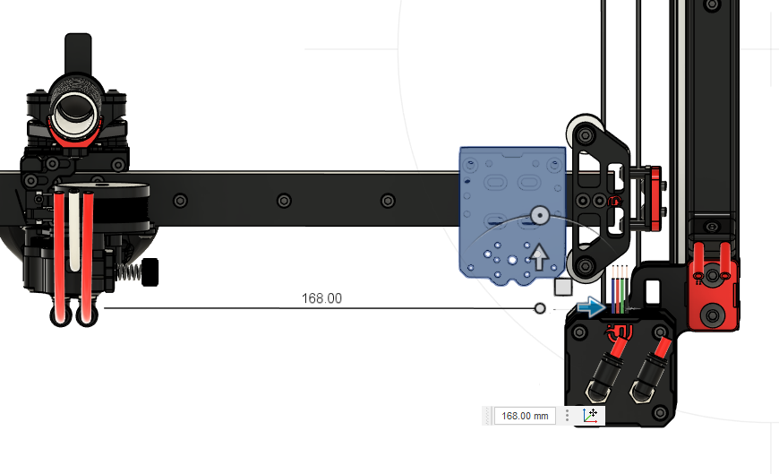

# [Monolith Gantry](https://github.com/CloakedWayne/Monolith_Gantry_V2-VT)

This might be one of the coolest mod I have seen. I have always wanted to do an AWD mod. Who needs a I4 when you can have a V8? However, early AWD mods for Voron 2.4 block off part of a build plate. This makes defining printable area tricky, and I don't trust myself with remembering where i can and can't use. I'm sure there are ways around it from the original creaters and the community, but these issues, together with the lack of a better understanding stopped me before I get to learn more. 

Then there's the Monolith. It's configurable, does not block the print bed, and a vibrant community. The BOM configurator is easy to use (you need to run it in google sheets. Customization is borked if you download it), but there is no installation manual. One can always use the included .step file to have a finished view, and make out steps to do, but this can be compiled better. I will document each step in my build (printed everything, flying gantry, AWD, 6mm belts, 2 short shafted motors, no sensorless homing, no front/rear protrusion) as much as i can [for those who come after](https://www.youtube.com/watch?v=p00EF6_b5pI&list=RDp00EF6_b5pI&start_radio=1). 

## Plan:
I like to change one thing at a time to better evaluate and trouble shoot my projects, but there's a lot in changing a gantry. We need to consider compatibility in toolhead and z-homing methods, so I looked into this. As it turns out, the belt spacing on a Monolith gantry is identical to that in a standard voron gantry, aside from the fact that the belts are moved outward by ~0.8mm. 

This means that whatever z-homing method/carrige you used with a standard voron build most likely works fine here. The other concern is toolhead. It needs to physically fit in the new constraints set by the front motors, and the constraints are tight to say the least. 

Luckily, there are three redeeming qualities. 
1. The space is tight, but large enough. The only necesseties to put in the constrainted space are hotend, hotend fans, and extruder. The extruder can be positioned close enough to the rail to dodge the Nema 17 motors, and the hotend takes even less space. Thus, a toolhead that wastes no space is totally possible.
2. Unless you are working with 4 short shafted motors, all motors will be on top of the gantry. This means you can put as much things as possible under the X-axis. Certain toolhead designs (like the [Gustav Railway Toolhead](https://github.com/RCI-Nicket/Gustav-Railway-Toolhead)) leverages this and puts the part cooling fan under. 
3. I found about 10mm of Y-overtravel in my machine. This means you can fit a CPAP chute down behind the X-axis. 
Overall, a monolith toolhead that preserves all build volume is indeed possible, and there are ongoing progresses to tackle them.

I also need to look into VZbot's toolheads, and how they handle their z-offest and bed mesh generation.

## Comparisons to other AWD projects
The other two AWD projects I looked into are [Mammoth](https://github.com/mammoth-3D/Mammoth-FDM-MODs) and the OG AWD setup by [aTinyShellScript](https://github.com/aTinyShellScript/v2.4_AWD). The mammoth has an interesting design
 that seem to draw more insporation from [VZbot](https://github.com/VzBoT3D/VzBoT-Vz330). It looks extra spacious, and seems to not have any physical constaint from the front motors at all in the same frame of a voron 2.4. This drew my attention: if the z axis beams are at the same position and the Nema 17 motors are a fixed size, there is no reason why it wont block off build volumes for Mammoth while it does for Voron, assuming the same build volume. As it turns out, there's no magic, but subtle differences. 

| Part | mammoth | Voron (and monolith) |
| -------- | ------- |
| X rail | 380mm | 400mm |
| X beam | 414mm | 430mm |
| slider | MGN9H | MGN12H |
| slider width | 39.9mm | 45.3mm |
| Max Effective X travel | 340.1 | 354.7 |

Tinkering with the CAD, I found that the max travel of a mammoth is around 336mm on the X-axis. 

What do you know, the VZbot has a 330mm build. I guess this makes sense. 

Keeping in mind that the nema 17 motors on a monolith blocks off 8.5mm on each side. If we cut those parts out, we get 333mm of travel. Close enough. 

The second contender is [aTinyShellScript's AWD setup](https://github.com/aTinyShellScript/v2.4_AWD) whose CAD files do not include a X-axis for me to tinker with. Luckily, there are other ways we can look into this. First of all, there is no reason to assume any difference on the back side. They all adapt from a stoick voron build with the 10mm overtravel without taking much extra space. On the front side, the Nema 17 motors are further away from the front of the Y-beam, blocking more space in the X and Y axis.

Given that preserving build volume is more important to me than optimization for speed, it is clear that monolith is the way to go.

## My Installation Manual
0. Aside from everything in the BOM, if you come from a standard 2 motor Core-XY build, you need 2 extra motors and 2 stepper drivers. 
1. I printed all my parts with ABS under standard [voron printed parts settings](https://docs.vorondesign.com/sourcing.html).
2. Install Heat Set Inserts: The BOM calls for 8 M3xD5x4 threaded inserts. There are 2 in each XY_joint_b, 1 in each tensioner_b, and 1 in each rear_motor_mount_a.
3. 